# 🏗️ KrishiMitra System Architecture

## Table of Contents

- [Overview](#overview)
- [System Architecture Diagram](#system-architecture-diagram)
- [Component Architecture](#component-architecture)
- [Data Flow](#data-flow)
- [API Architecture](#api-architecture)
- [Authentication Architecture](#authentication-architecture)
- [AI/ML Processing Pipeline](#aiml-processing-pipeline)
- [Mobile Architecture](#mobile-architecture)
- [Database Design](#database-design)
- [Security Architecture](#security-architecture)
- [Deployment Architecture](#deployment-architecture)
- [Current Implementation vs Future State](#current-implementation-vs-future-state)

## Overview

KrishiMitra follows a **cloud-native, microservices-based architecture** designed to provide intelligent agricultural recommendations to farmers through a mobile-first interface. The system processes raw agricultural data through AI models to deliver farmer-readable insights, recommendations, and alerts.

### Key Architectural Principles

- **Mobile-First**: React Native app as the primary interface
- **AI-Driven Processing**: Raw data → AI processing → Farmer-readable outputs
- **Cloud-Native**: Scalable backend infrastructure
- **Offline-Capable**: Local processing for critical features
- **Secure**: Authentication and data protection
- **Extensible**: Modular design for easy feature additions

## System Architecture Diagram


## Component Architecture

### 1. Frontend Components

```typescript
// Component Hierarchy
KrishiMitra App
├── Navigation
│   ├── BottomTabNavigator
│   └── StackNavigator
├── Screens
│   ├── DashboardScreen
│   ├── CropRecommendationsScreen
│   ├── MarketPricesScreen
│   ├── InsightsScreen (Soil & Weather)
│   └── ProfileScreen
├── Modals
│   ├── AIChatModal
│   ├── DiseaseDetectionModal
│   └── ProfileSettingsModal
├── Components
│   ├── WeatherCard
│   ├── SoilHealthCard
│   ├── CropCard
│   ├── AlertCard
│   └── ChartComponents
└── Services
    ├── APIService
    ├── AuthService
    ├── CacheService
    └── LocalStorageService
```

### 2. Backend Services Architecture

```python
# Service Architecture
Backend Services
├── Authentication Service (Supabase)
│   ├── User Registration/Login
│   ├── JWT Token Management
│   ├── Profile Management
│   └── Role-Based Access Control
├── Crop Recommendation Service
│   ├── Soil Data Processing
│   ├── Weather Data Integration
│   ├── AI Model Orchestration
│   └── Recommendation Generation
├── Weather Processing Service
│   ├── Weather API Integration
│   ├── Data Normalization
│   ├── Forecast Processing
│   └── Alert Generation
├── Market Analysis Service
│   ├── Price Data Collection
│   ├── Trend Analysis
│   ├── ML-based Predictions
│   └── Mandi Comparison
└── User Management Service
    ├── Profile Management
    ├── Preference Storage
    ├── Activity Tracking
    └── Analytics
```

## Data Flow

### Primary Data Flow: Farmer Recommendation Request

```mermaid
sequenceDiagram
    participant F as Farmer (Mobile App)
    participant G as API Gateway
    participant C as Crop Service
    participant W as Weather Service
    participant AI as AI Orchestrator
    participant LLM as LLM Processor
    participant DB as Database
    participant EXT as External APIs
    
    F->>G: Request Crop Recommendations
    G->>C: Forward Request with Auth
    
    Note over C,EXT: Fetch Raw Data
    C->>EXT: Get Soil Profile Data
    C->>W: Request Weather Data
    W->>EXT: Fetch Weather API
    W-->>C: Return Processed Weather
    EXT-->>C: Return Raw Soil Data
    
    Note over C,LLM: AI Processing
    C->>AI: Send Raw Data for Processing
    AI->>LLM: Process with Context
    Note over LLM: "Convert raw data to farmer-readable insights:<br/>- Soil pH 6.8 → 'Good for rice cultivation'<br/>- Weather forecast → 'Perfect planting conditions'<br/>- Generate profit estimates & reasoning"
    
    LLM-->>AI: Return Processed Insights
    AI-->>C: Farmer-Readable Recommendations
    
    C->>DB: Store Recommendation History
    C-->>G: Return Structured Response
    G-->>F: Deliver Final Recommendations
    
    Note over F: Display:<br/>- Crop suggestions with reasons<br/>- Profit estimates<br/>- Confidence scores<br/>- Action items
```



### Weather Alert Flow

```mermaid
sequenceDiagram
    participant WS as Weather Service
    participant EXT as Weather API
    participant AI as AI Processor
    participant NS as Notification Service
    participant F as Farmer App
    
    Note over WS: Scheduled Weather Check
    WS->>EXT: Fetch Latest Weather Data
    EXT-->>WS: Raw Weather JSON
    
    WS->>AI: Analyze for Farming Impact
    Note over AI: Process:<br/>- Heavy rain → "Cover crops"<br/>- Drought → "Increase irrigation"<br/>- Temperature → "Optimal/Warning"
    
    AI-->>WS: Farmer-Readable Alerts
    WS->>NS: Send Alerts for Distribution
    NS->>F: Push Notifications
    
    Note over F: Display Color-Coded Alerts:<br/>🔴 Critical: Take immediate action<br/>🟠 Moderate: Monitor closely<br/>🟢 Normal: Continue as usual
```



### Disease Detection Flow (On-Device)


## API Architecture

### API Response Format Standard

All backend APIs return processed, farmer-readable data in this format:

```json
{
  "status": "success",
  "data": {
    "recommendations": [
      {
        "crop": {
          "name": "Paddy Rice",
          "local_name": "धान",
          "confidence": 92
        },
        "reasoning": {
          "primary_reasons": [
            "Your soil pH (6.8) is perfect for rice cultivation",
            "Current moisture level (45%) supports paddy growth",
            "Monsoon prediction shows ideal rainfall pattern"
          ],
          "farmer_explanation": "आपकी मिट्टी धान के लिए एकदम सही है। बारिश भी अच्छी होने वाली है।"
        },
        "economics": {
          "expected_yield": "4.2 tons per hectare",
          "profit_estimate": "₹45,000 per hectare",
          "investment_needed": "₹25,000 per hectare",
          "roi_percentage": 80
        },
        "actionable_steps": [
          "Start field preparation by next week",
          "Use certified seeds from local agriculture center",
          "Apply recommended fertilizer based on soil test"
        ]
      }
    ]
  },
  "metadata": {
    "generated_at": "2025-01-21T10:30:00Z",
    "location": "Ranchi, Jharkhand",
    "season": "Kharif 2025"
  }
}
```

### API Endpoints Design

```yaml
# Crop Recommendations API
GET /api/v1/crops/recommendations
Parameters:
  - location: string (required)
  - soil_type: string (optional)
  - budget: number (optional)
  - experience_level: enum (beginner, intermediate, expert)
Response: Processed crop recommendations with reasoning

# Weather Insights API  
GET /api/v1/weather/insights
Parameters:
  - location: string (required)
  - days: number (default: 7)
Response: Farmer-readable weather analysis with farming impact

# Market Intelligence API
GET /api/v1/market/analysis
Parameters:
  - crops: array (optional)
  - region: string (required)
Response: Market trends with selling recommendations

# Soil Health API
GET /api/v1/soil/health
Parameters:
  - location: string (required)
  - test_data: object (optional)
Response: Soil health score with improvement suggestions
```

## Authentication Architecture

### Supabase Integration

```typescript
// Authentication Flow
interface AuthArchitecture {
  provider: 'Supabase';
  methods: [
    'email_password',
    'phone_otp',
    'google_oauth',  // Future
    'facebook_oauth' // Future
  ];
  
  user_profile: {
    basic_info: {
      name: string;
      phone: string;
      location: Location;
      language: 'hindi' | 'english';
    };
    
    farming_profile: {
      experience_years: number;
      farm_size: number;
      primary_crops: string[];
      farming_type: 'organic' | 'conventional' | 'mixed';
    };
    
    preferences: {
      notification_settings: NotificationSettings;
      language: string;
      units: 'metric' | 'imperial';
    };
  };
}
```

### Security Layers


## AI/ML Processing Pipeline

### LLM Processing Workflow

```python
class AIProcessor:
    """
    Converts raw agricultural data into farmer-readable insights
    """
    
    def process_crop_recommendation(self, raw_data: dict) -> dict:
        """
        Input: Raw JSON from Soil/Weather APIs
        Output: Farmer-readable recommendations with reasoning
        """
        
        prompt = f"""
        You are an expert agricultural advisor for Indian farmers.
        Convert this raw data into clear, actionable recommendations:
        
        Soil Data: {raw_data['soil']}
        Weather Data: {raw_data['weather']}
        Location: {raw_data['location']}
        Season: {raw_data['season']}
        
        Provide:
        1. Top 3 crop recommendations with confidence scores
        2. Clear reasoning in simple language (Hindi/English)
        3. Profit estimates based on current market conditions
        4. Step-by-step action plan
        5. Risk factors and mitigation strategies
        
        Format for farmers with limited technical knowledge.
        """
        
        return self.llm_client.process(prompt)
    
    def generate_weather_alerts(self, weather_data: dict) -> list:
        """
        Convert weather forecasts into actionable farming alerts
        """
        pass
    
    def analyze_market_trends(self, price_data: dict) -> dict:
        """
        Process market data into selling recommendations
        """
        pass
```

### ML Model Architecture


## Mobile Architecture

### React Native App Structure

```typescript
// App Architecture
interface AppArchitecture {
  navigation: {
    type: 'bottom-tabs';
    screens: [
      'Dashboard',
      'CropRecommendations', 
      'MarketPrices',
      'Insights'
    ];
  };
  
  state_management: {
    global_state: 'React Context + useReducer';
    local_state: 'useState + useEffect';
    cache: 'AsyncStorage';
    offline_sync: 'Custom sync service';
  };
  
  data_layer: {
    api_client: 'Axios with interceptors';
    cache_strategy: 'Cache-first with TTL';
    offline_support: 'Store requests for later sync';
    mock_data: 'Development mode fallback';
  };
  
  ui_components: {
    design_system: 'Custom components';
    charts: 'react-native-gifted-charts';
    icons: 'Ionicons';
    animations: 'react-native-reanimated';
  };
}
```

### Offline Architecture


## Database Design

### MongoDB Schema Design

```javascript
// User Collection
{
  _id: ObjectId,
  auth_id: "supabase_user_id",
  profile: {
    name: "राम कुमार",
    phone: "+91-9876543210",
    location: {
      state: "Jharkhand",
      district: "Ranchi",
      village: "Mandar",
      coordinates: [85.3096, 23.3441]
    },
    language: "hindi",
    farming_profile: {
      experience_years: 15,
      farm_size_acres: 2.5,
      primary_crops: ["rice", "wheat"],
      farming_type: "conventional"
    }
  },
  preferences: {
    notifications: true,
    language: "hindi",
    units: "metric"
  },
  created_at: ISODate,
  updated_at: ISODate
}

// Recommendations Collection
{
  _id: ObjectId,
  user_id: ObjectId,
  request_data: {
    location: {},
    season: "kharif_2025",
    soil_data: {},
    weather_data: {}
  },
  recommendations: [
    {
      crop: {
        name: "Paddy Rice",
        local_name: "धान",
        confidence: 92
      },
      reasoning: {
        factors: [],
        explanation: "मिट्टी और मौसम धान के लिए उपयुक्त है"
      },
      economics: {
        yield_estimate: "4.2 tons/hectare",
        profit_estimate: 45000,
        investment_needed: 25000
      }
    }
  ],
  generated_at: ISODate,
  feedback: {
    rating: Number,
    implemented: Boolean,
    results: {}
  }
}

// Market Data Collection
{
  _id: ObjectId,
  crop: "paddy_rice",
  region: "jharkhand",
  prices: [
    {
      mandi: "Ranchi Mandi",
      price: 2340,
      date: ISODate,
      quality: "A_grade"
    }
  ],
  trends: {
    weekly_change: 5.2,
    monthly_trend: "upward",
    prediction: {
      next_week: 2380,
      confidence: 78
    }
  },
  updated_at: ISODate
}
```

## Security Architecture

### Security Implementation

```yaml
Authentication:
  - Supabase JWT tokens
  - Refresh token rotation
  - Multi-factor authentication (planned)
  
Authorization:
  - Role-based access control
  - Resource-level permissions
  - API endpoint protection
  
Data Security:
  - AES-256 encryption at rest
  - TLS 1.3 in transit
  - PII data masking
  - GDPR compliance
  
API Security:
  - Rate limiting per user/endpoint
  - Input validation and sanitization
  - SQL injection prevention
  - XSS protection
  
Mobile Security:
  - Certificate pinning
  - Keychain/Keystore for sensitive data
  - Biometric authentication
  - Anti-tampering measures
```

## Deployment Architecture

### Cloud Infrastructure


### Development vs Production

```yaml
Development Environment:
  - Local FastAPI server
  - Local MongoDB instance
  - Mock external APIs
  - Development Supabase project
  - Expo development server
  
Staging Environment:
  - Cloud-hosted APIs
  - Staging database
  - Real external APIs (limited)
  - Staging Supabase project
  - Pre-production testing
  
Production Environment:
  - Auto-scaling FastAPI instances
  - MongoDB Atlas cluster
  - Production external APIs
  - Production Supabase project
  - CDN for mobile app distribution
```

## Current Implementation vs Future State

### Current State (Mock Data)

```typescript
// Current: Mock Data Architecture
interface CurrentArchitecture {
  frontend: {
    platform: 'React Native + Expo';
    data_source: 'Mock JSON objects';
    processing: 'Client-side formatting';
    offline: 'Static data only';
  };
  
  backend: {
    status: 'Planned';
    current: 'Mock data in components';
    auth: 'Not implemented';
  };
  
  data_flow: 'Mock Data → Frontend Display';
}

// Mock Data Example
const mockProcessor = {
  getCropRecommendations: () => ({
    recommendations: [
      {
        crop: { name: "Paddy Rice", hindiName: "धान" },
        confidence: 92,
        reasons: ["High soil moisture", "Optimal pH"],
        profit: "₹45,000/hectare"
      }
    ]
  })
};
```

### Future State (Full Implementation)

```typescript
// Future: Complete Architecture
interface FutureArchitecture {
  frontend: {
    platform: 'React Native + Expo';
    data_source: 'Backend APIs';
    processing: 'Server-side AI processing';
    offline: 'Full offline sync capability';
  };
  
  backend: {
    status: 'Fully Implemented';
    auth: 'Supabase integration';
    apis: 'FastAPI with AI processing';
    database: 'MongoDB with analytics';
  };
  
  data_flow: 'Raw APIs → AI Processing → Farmer-Readable → Frontend';
}

// Real API Integration Example
const apiProcessor = {
  getCropRecommendations: async (location, soilData) => {
    // 1. Fetch raw data from multiple APIs
    const rawData = await Promise.all([
      weatherAPI.getForecast(location),
      soilAPI.getProfile(location, soilData),
      marketAPI.getPrices(location)
    ]);
    
    // 2. Process through AI/LLM
    const processedInsights = await aiProcessor.generateRecommendations({
      weather: rawData[0],
      soil: rawData[1], 
      market: rawData[2],
      context: 'Indian farmer, Jharkhand region'
    });
    
    // 3. Return farmer-readable format
    return processedInsights;
  }
};
```

### Migration Path


### API Keys & Documentation (Future Phase)

```yaml
External API Integration:
  Weather APIs:
    - OpenWeatherMap API
    - AccuWeather API
    - India Meteorological Department API
    
  Soil Data APIs:
    - ISRO Bhuvan Soil Health API
    - NBSS&LUP Soil Database API
    - State Agriculture Department APIs
    
  Market Price APIs:
    - eNAM (National Agriculture Market) API
    - Commodity Exchange APIs
    - State Mandi Board APIs
    
  AI/ML APIs:
    - OpenAI GPT API (for text processing)
    - Google Gemini API (for multimodal AI)
    - Custom ML models (hosted on cloud)

Documentation Structure:
  - API endpoint documentation
  - Authentication guides
  - Rate limiting information
  - Error handling examples
  - SDK/client libraries
```

---

**Note**: This architecture document represents the complete system design. The current implementation uses mock data and will be gradually migrated to the full architecture as described in the migration path above.